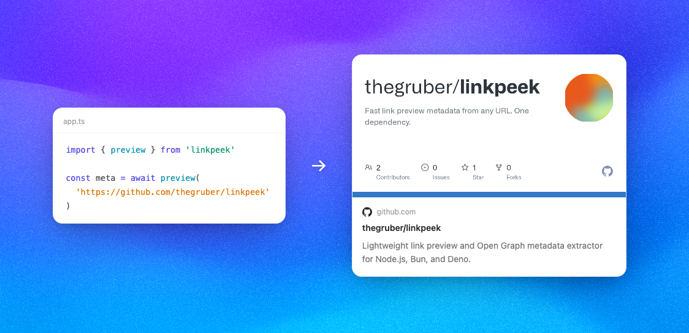

# linkpeek

**Link preview extraction for Node.js, Bun, and Deno. One dependency.**

[](https://www.npmjs.com/package/linkpeek)
[](https://bundlephobia.com/package/linkpeek)
[](https://github.com/thegruber/linkpeek/actions/workflows/ci.yml)
[](https://www.npmjs.com/package/linkpeek)
[](LICENSE)

<p align="center">
  
</p>

<p align="center">
  <a href="https://github.com/thegruber">
    
  </a>
  <a href="https://twitter.com/adrgruber">
    
  </a>
</p>

```typescript
import { preview } from "linkpeek";

const result = await preview("https://www.youtube.com/watch?v=dQw4w9WgXcQ");

result.title;       // "Rick Astley - Never Gonna Give You Up"
result.image;       // "https://i.ytimg.com/vi/dQw4w9WgXcQ/maxresdefault.jpg"
result.siteName;    // "YouTube"
result.favicon;     // "https://www.youtube.com/favicon.ico"
result.description; // "The official video for \"Never Gonna Give You Up\"..."
```

## Install

```bash
npm install linkpeek
```

Also works with `bun add linkpeek` and `import { preview } from "npm:linkpeek"` (Deno).

## Why linkpeek

- **1 dependency** (htmlparser2) — not 4, not a plugin tree
- **Stops at `</head>`** — downloads 30 KB, not the full 2 MB page
- **SAX streaming** — no DOM construction, ~2 ms parse time
- **SSRF protection** — private/internal IPs blocked by default
- **Runs on Node.js 20+, Bun, and Deno** (tested in CI) — uses only Web Standard APIs

> **Note:** linkpeek should be used server-side only. Use it in an API route and return the result to the client.

---

## Full Result

All 22 fields extracted from a single URL:

```typescript
{
  url: "https://www.youtube.com/watch?v=dQw4w9WgXcQ",
  statusCode: 200,
  title: "Rick Astley - Never Gonna Give You Up (Official Video) (4K Remaster)",
  description: "The official video for \"Never Gonna Give You Up\" by Rick Astley...",
  image: "https://i.ytimg.com/vi/dQw4w9WgXcQ/maxresdefault.jpg",
  imageAlt: null,
  imageWidth: 1280,
  imageHeight: 720,
  siteName: "YouTube",
  favicon: "https://www.youtube.com/favicon.ico",
  mediaType: "video.other",
  author: null,
  canonicalUrl: "https://www.youtube.com/watch?v=dQw4w9WgXcQ",
  locale: null,
  publishedDate: null,
  video: "https://www.youtube.com/embed/dQw4w9WgXcQ",
  twitterCard: "player",
  twitterSite: "@youtube",
  twitterCreator: null,
  themeColor: null,
  keywords: ["rick astley", "Never Gonna Give You Up", "rick roll"],
  oEmbedUrl: "https://www.youtube.com/oembed?format=json&url=https%3A%2F%2Fwww.youtube.com%2Fwatch%3Fv%3DdQw4w9WgXcQ"
}
```

## Presets

```typescript
import { preview, presets } from "linkpeek";

// Default: fast (30 KB limit, head only, no meta-refresh)
const result = await preview(url);

// Quality: body JSON-LD + image fallback + meta-refresh
const result = await preview(url, presets.quality);

// Custom: spread a preset and override
const result = await preview(url, { ...presets.quality, timeout: 3000 });
```

| Preset            | What it enables                             |
| ----------------- | ------------------------------------------- |
| `presets.fast`    | Default behavior — explicit version of `{}` |
| `presets.quality` | Body JSON-LD, image fallback, meta-refresh  |

## Error Handling

`preview()` throws for invalid input and blocked URLs:

```typescript
try {
  const result = await preview(url);
} catch (err) {
  // "Invalid URL"
  // "Only http and https URLs are supported"
  // "URLs pointing to private/internal networks are not allowed"
  console.error(err.message);
}
```

## API

### `preview(url, options?)`

Fetches a URL and extracts link preview metadata. Returns `Promise<PreviewResult>`.

#### Options

| Option               | Type                     | Default            | Description                                                                                                                                                 |
| -------------------- | ------------------------ | ------------------ | ----------------------------------------------------------------------------------------------------------------------------------------------------------- |
| `timeout`            | `number`                 | `8000`             | Request timeout in milliseconds                                                                                                                             |
| `maxBytes`           | `number`                 | `30_000`           | Max bytes to stream                                                                                                                                         |
| `userAgent`          | `string`                 | `"Twitterbot/1.0"` | User-Agent sent with requests. Twitterbot gets pre-rendered HTML from most platforms                                                                        |
| `followRedirects`    | `boolean`                | `true`             | Follow HTTP 3xx redirects                                                                                                                                   |
| `headers`            | `Record<string, string>` | `{}`               | Extra request headers (e.g. cookies, auth tokens)                                                                                                           |
| `allowPrivateIPs`    | `boolean`                | `false`            | Allow fetching private/internal IPs. Keep `false` in production to prevent SSRF attacks                                                                     |
| `followMetaRefresh`  | `boolean`                | `false`            | Follow `<meta http-equiv="refresh">` redirects when no title is found. Enable to handle Cloudflare-challenged pages at the cost of an extra HTTP round-trip |
| `includeBodyContent` | `boolean`                | `false`            | Continue scanning `<body>` for JSON-LD scripts and `` fallbacks after `</head>`. Enable together with a higher `maxBytes` for best quality             |

#### Result Fields

| Field            | Type               | Description                                                                                                                                             |
| ---------------- | ------------------ | ------------------------------------------------------------------------------------------------------------------------------------------------------- |
| `url`            | `string`           | Final resolved URL                                                                                                                                      |
| `statusCode`     | `number`           | HTTP status code (200, 301, 404, etc.). Returns `0` when using `parseHTML()` directly                                                                   |
| `title`          | `string \| null`   | Page title (`og:title` → `twitter:title` → JSON-LD → `<title>`)                                                                                         |
| `description`    | `string \| null`   | Description (`og:description` → `twitter:description` → `meta[name=description]` → JSON-LD)                                                             |
| `image`          | `string \| null`   | Preview image (`og:image` → `twitter:image` → JSON-LD → `itemprop=image` → first ``)                                                               |
| `imageAlt`       | `string \| null`   | Image alt text (`og:image:alt` → `twitter:image:alt`)                                                                                                   |
| `imageWidth`     | `number \| null`   | Image width from `og:image:width`                                                                                                                       |
| `imageHeight`    | `number \| null`   | Image height from `og:image:height`                                                                                                                     |
| `siteName`       | `string`           | Site name (`og:site_name` → JSON-LD publisher → hostname fallback)                                                                                      |
| `favicon`        | `string \| null`   | Favicon URL (largest `apple-touch-icon` → `link[rel=icon]` → `/favicon.ico`)                                                                            |
| `mediaType`      | `string`           | Content type from `og:type`, defaults to `"website"`                                                                                                    |
| `author`         | `string \| null`   | Author name (JSON-LD author → `meta[name=author]` → Dublin Core)                                                                                        |
| `canonicalUrl`   | `string`           | Canonical URL (`link[rel=canonical]` → `og:url` → request URL)                                                                                          |
| `locale`         | `string \| null`   | Locale from `og:locale`                                                                                                                                 |
| `publishedDate`  | `string \| null`   | Published date (`article:published_time` → JSON-LD `datePublished` → Dublin Core)                                                                       |
| `video`          | `string \| null`   | Video URL from `og:video`                                                                                                                               |
| `twitterCard`    | `string \| null`   | Twitter card type (`summary`, `player`, `summary_large_image`)                                                                                          |
| `twitterSite`    | `string \| null`   | Twitter @handle from `twitter:site`                                                                                                                     |
| `twitterCreator` | `string \| null`   | Author's Twitter @handle from `twitter:creator`                                                                                                         |
| `themeColor`     | `string \| null`   | Theme color from `meta[name=theme-color]`                                                                                                               |
| `keywords`       | `string[] \| null` | Keywords from `meta[name=keywords]`                                                                                                                     |
| `oEmbedUrl`      | `string \| null`   | Discovered oEmbed endpoint URL from `<link rel="alternate" type="application/json+oembed">`. Not fetched — returned for the caller to resolve if needed |

### `parseHTML(html, baseUrl, options?)`

Parses an HTML string directly. Use this when you already have the HTML.

```typescript
import { parseHTML } from "linkpeek";

const result = parseHTML(
  "<html><head><title>Hello</title></head></html>",
  "https://example.com",
);
console.log(result.title); // "Hello"
```

**Parameters:**

- `html` (`string`) — The HTML content to parse
- `baseUrl` (`string`) — Base URL for resolving relative URLs
- `options?` (`{ includeBodyContent?: boolean }`) — Pass `{ includeBodyContent: true }` to scan `<body>` for JSON-LD and image fallbacks

Returns `PreviewResult`.

---

## How it works

1. **Twitterbot User-Agent** — gets pre-rendered HTML from most platforms, skipping client-side rendering entirely

2. **Streaming download with byte limit** — aborts after 30 KB (default). OG tags live in the first 10-30 KB; YouTube pages are 2 MB+ but we never download more than needed

3. **SAX parsing** — processes HTML as a character stream with no DOM construction. ~2 ms parse time

4. **Head-first parsing** — all standard metadata is in `<head>`. Body scanning for JSON-LD and `` fallbacks is opt-in via `includeBodyContent: true` (or `presets.quality`)

5. **Zero extra HTTP calls** — no favicon fetching from Google APIs, no oEmbed resolution by default

---

## Framework Examples

| Example | Runtime | Description |
| ------- | ------- | ----------- |
| [Next.js API Route](./examples/nextjs-app-router) | Node | App Router route handler |
| [Express](./examples/express-api) | Node | `/api/preview?url=` endpoint |
| [Cloudflare Worker](./examples/cloudflare-worker) | Edge | Deploy link previews to the edge |
| [React Component](./examples/react-preview-card) | Browser | `<LinkPreview>` card component |
| [Supabase Edge Function](./examples/supabase-edge-function) | Deno | Edge function for Supabase projects |
| [Bun Server](./examples/bun-server) | Bun | Minimal Bun.serve() example |

## License

MIT

## Contributing

Contributions are welcome. Please read `CONTRIBUTING.md` before opening a pull request.

## Security

If you discover a vulnerability, please follow the reporting process in `SECURITY.md`.
